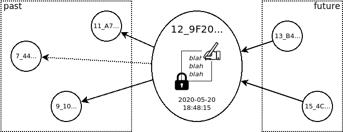
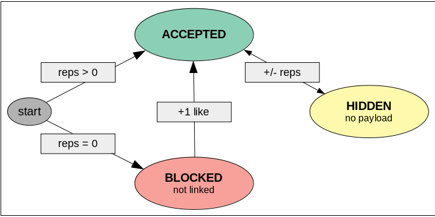

# Freechains: Post / Message / Block

The terms *post*, *message*, and *block* are used interchangeably and they all
represent the unit of content in Freechains.
An author has a *message* to disseminate (e.g., a text or file) and creates a
*post* in a [chain](chains.md), which stores it in a *block* that contains only
that message.

A block is a data structure that persists a single message in a chain, linking
back to past messages and being linked from future messages:



```
data Block :
    msg   : String              ; (1)
    sign? :                     ; (2)
        pub : HKey
        sig : String
    core  :                     ; (3)
        time  : Long
        msg   :
            crypt : Boolean
            hash  : Hash
        like? :
            hash : Hash
            n    : Int
        backs : Array<Hash>
    hash  : Hash                ; (4)
```

The block data structure is composed of four parts:

1. The actual message to be held in the block.
2. An optional signature including the public key of the signer (`pub`) and the
   actual signature (`sig`).
3. The core of the block with all sensitive information about the message
   (its creation time, if it's encrypted, if it's a like or dislike), and links
   to previous blocks.
4. The digest (`hash`) of the core which univocally identifies the block.
   The hash of the block takes into account the hash of actual message.
   The digest is prefixed with the height of the block in the chain, e.g.,
   `5_F700CC98A6BA6A562CF6272AFC1044CB0F049E2E71D1076DA3391E85EE2CE2B8`
   (block is height `5` with digest `F700CC...`).

A post has three possible states: *BLOCKED*, *ACCEPTED*, or *HIDDEN*.



If the author has [reputation](reps.md), a new post is immediately *ACCEPTED*
in the chain.
Otherwise, it is *BLOCKED* and requires a like from another user.
Blocked posts are not considered part of the chain DAG in the sense that new
posts do not link back to it.
Peers are not required to hold blocked posts and neither retransmit them to
other peers.
However, if blocked posts are not disseminated, new users will never have the
chance to be welcomed with a like.
Currently, Freechains holds at most *15* blocked posts in a temporary bag and
retransmit them for some visibility in the network.
Once accepted, a post becomes part of the chain and can never be removed again,
since Merkle DAGs are immutable by design.
However, if the number of dislikes exceeds the number of likes, the block
becomes *HIDDEN* and its payload is not retransmitted to other peers.
Note that a block hash depends only on its payload hash, so it is safe to
remove the actual payload as long as one can prove its hidden state.
Later, if the post receives new likes and changes its state again, it means
that the payload is still known somewhere and peers can request it when
synchronizing again.
