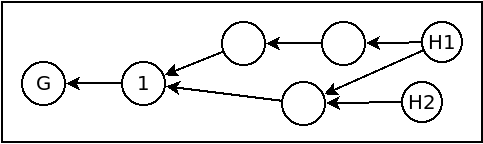

# Freechains: Chains

A chain represents a topic in the publish-subscribe model of Freechains.
Peers synchronize their chains to disseminate content in the network.
A chain is a tree of messages or [blocks](blocks.md) linked from a set of heads
down to the genesis block:



The heads are the youngest blocks received by the peer, and might not be the
same in all peers in the network due to connectivity and latency issues.
Each block has a set of back links pointing to previous blocks.
The oldest block is the *genesis block* and is the same in all peers, since it
is derived from the name and parameters of the chain.
The chain structure forms a [Merkle Tree](https://en.wikipedia.org/wiki/Merkle_tree),
which is tamper proof.
This means that if two peers both have `H1` and `H2` on their trees, then the
subtrees starting from these blocks and going back to the genesis block must be
the same in both peers.

A chain is univocally identified by a unique hash code from its own name.
For example, the chain `#chat` has identifier
`HASH(chain,args) = A95B969D21FC983337B1D1B3EAF38421B9E41A03A14DBCA088435590A22D585C`.
The genesis block of the chain has the same identifier of the chain itself.
This means that any peer in the network using the same arguments to join a
chain are sharing the same chain.
The [command](cmds.md#chains-join) to join a chain is as follows:

```
$ freechains chains join <chain-name> [<key>]
```

Note that Freechains provides a `join` instead a `create` command.
The reason is that chains have no "creators", since different users in
different hosts at different moments can issue the same command to reach
exactly the same initial state.
Joining a chain means to reserve a local space for blocks and to become
available to synchronize with other peers.

Freechains supports three types of chains with different purposes:

- *Public Forum Chain:*
    - `N<->N` public communication.
    - Public communication among untrusted participants.
    - Examples: Q&A forums, chats, consumer-to-consumer sales.
- *Private Group Chain:*
    - `1<->1`, `N<->N`, `1<-` private communication.
    - Secure communication between pairs, groups, and alone (with itself).
    - Examples: e-mail, family WhatsApp group, backup.
- *Public Identity Chain:*
    - `1->N` and `1<-N` communication.
    - A public identity broadcasts content to an audience (`1->N`) with
      optional feedback (`1<-N`).
    - Examples: news site, streaming service, public profile in social media.

The type of the chain is determined by the prefix in its name:

- `#`: public forum (e.g., `#chat`)
    - requires a pioneer public `<key>` on join
- `$`: private group (e.g., `$family`)
    - requires a shared `<key>` on join
- `@`: public identity (e.g., `@B2853F4570903EF3ECC941F3497C08EC9FB9B03C4154D9B27FF3E331BC7B6431`)
    - if second character is `!`, only the chain owner can post
    - the rest of the name is the owner's public key

<!-- BLAKE2b Curve25519 -->

## Public Forum Chain

In a public forum chain, messages circulate among untrusted (possibly
malicious) users and peers (`N<->N` communication).
For this reason, chains of this type must rely on the
[reputation system](reps.md) of Freechains to be viable in a completely
decentralized setting.
Without any control, the contents of a public forum chain are at mercy of
excess, SPAM, fake news, illegal content, and abusive behavior.

A public forum chain uses the prefix `#` in its name:

```
$ freechains chains join '#sports' '@59BD9ED9A42EC1E63ABB8FEF5164893C7DD51A2B1E625376F3463EDB7846A807'
```

The key argument identifies the chain pioneer which starts with *30 reps* in
the reputation system.

A public key can be [generated](cmds.md#crypto-create) from a secret
passphrase:

```
$ freechains crypto pubpvt '<my-very-strong-passphrase>'
59BD9E... 8889BB...     # generated public and private keys
```

## Private Group Chain

In a private group chain, all messages are encrypted using a key shared by
trusted peers only.
It can be used in `1<-1` communication such as e-mail conversations, `N<->N`
communication in small groups such as for family and close friends, and also
in `1<-` "self communication" such as a personal to-do list and backups.

A private chain uses the prefix `$` in its name:

```
freechains chains join "$friends" 8889BB68FB44065BBEC8D7441C53D50362737782445ADF0EB167A5DEF354D638
```

In a private group chain, all users have infinite reputation and they are not
even required to sign messages.
All messages are automatically encrypted on creation and decrypted on receipt
using the shared key.

A shared key can be [generated](cmds.md#crypto-create) from a secret
passphrase:

```
$ freechains crypto shared '<my-very-strong-passphrase>'
8889BB68FB44065BBEC8D7441C53D50362737782445ADF0EB167A5DEF354D638
```

The key has to be shared among the trusted friends by other means, such as
through their public identity chains.

## Public Identity Chain

A public identity represents a person or organization that wants to publish
content to a target audience (`1->N` communication).
A person can be a blogger communicating ideas, an artist performing live, a
politician announcing actions, etc.
An organization can be a newspaper publishing news, a company advertising its
products, a streaming service broadcasting shows, or even a government
sanctioning laws.

A public identity chain uses the prefix `@` in its name:

```
$ freechains chains join '@B2853F4570903EF3ECC941F3497C08EC9FB9B03C4154D9B27FF3E331BC7B6431'
```

The rest of the name is public key of the chain owner holding the associated
private key.
The chain owner has infinite [reputation](reps.md) and other users may be
prohibited to post if the prefix `@!` is used.
If other users are allowed to post, they may encrypt messages with the owner's
public key so that only s/he can read it (`1<-N` communication).

The public identity should keep its private key in secret and disclose the
public key to the target audience.
Then, both the public identity and target audience should use the same
parameters to join the chain.

As an example, suppose a company with the generated keys wants to advertise its
products with disabled feedback from consumers:

```
$ freechains chains join '@!59BD9E...'
```

To post in the chain, the public identity should always sign its posts:

```
$ freechains --sign='503627377824...' chain '@!59BD9E...' post inline 'Hello World!'
```
