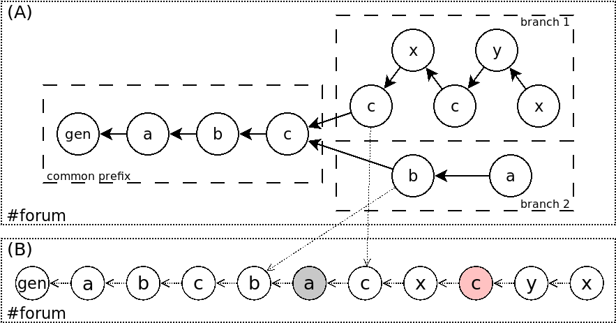
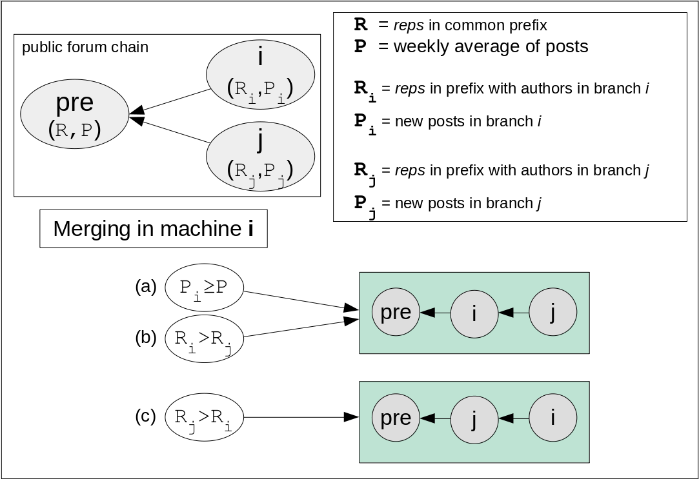

# Freechains: Consensus Order

Due to the concurrent nature of the peer-to-peer network, a chain forms a DAG
that represents a partial order between its posts.
However, branches in DAGs create ambiguity in the total order of messages,
which is a fundamental obstacle to reach consensus.
For instance, it is possible that branches carry conflicting operations, such
as posting a new message in one branch with a denying dislike in another
branch: conforming to the [reputation system](reps.md), a dislike may
invalidate a new post depending on its author reputation.
Freechains employs a consensus algorithm to enforce the same message ordering
across peers and thus validate concurrent operations consistently.

Freechains order posts favoring branches with users that constitute the
majority of reputation in the network:

Figure A illustrates the consensus criterion.
A public forum DAG has a common prefix with users **a**, **b**, and **c**.
Let’s assume that within the prefix, users **a** and **b** have more reputation
combined than **c** has alone.
After the prefix, the forum forks in two branches:
    in *branch 1*, only user **c** remains active and **x** and **y** are new users with no previous reputation;
    in *branch 2*, only users **a** and **b** participate but with less activity.
Nonetheless, *branch 2* is ordered first because, before the forking point,
**a** and **b** have more reputation than **c**, **x**, and **y** combined.

Figure B indicates the consensus order between all blocks in the chain.
All operations in *branch 2* appear before any operation in **branch 1**.
The ordered list after consensus exists for accountability purposes, and is
only a view of the primary DAG structure.
At any point in the consensus timeline, if an operation fails, all remaining
blocks in the offending branch are removed from the primary DAG.

As an example, suppose the last post by **a** (in gray) is a dislike to user
**c**.
Then, it’s possible that the last post by **c** (in red), now with *0 reps*, is
rejected together with all posts by **y** and **x** in sequence.
Note that in a Merkle DAG, it is not possible to remove only the block with the
failing operation, instead, Freechains removes the remaining branch completely,
as if it never existed.

As an additional rule to consensus, long-lasting branches do not merge,
creating *hard forks* in the network.
A hard fork occurs when a branch contains at least 7 days of activity
considering the average of the last 28 days in the common prefix.
As an example, if the common prefix has 100 posts in the last 28 days, the week
average is 25 posts.
Hence, if both branches contain more than 25 new posts, they cannot be merged.

Merging in machine **i**:

- (a) **i** is ordered first if **i** has more posts than the week average in the common prefix.
- (b) **i** is ordered first if **i** has more reputation in the common prefix.
- (c) **j** is ordered first if **j** has more reputation in the common prefix.
- (d) otherwise, branches are ordered by lexicographical order of the block hashes after the common prefix.

Merging in machine **j** is analogous.
