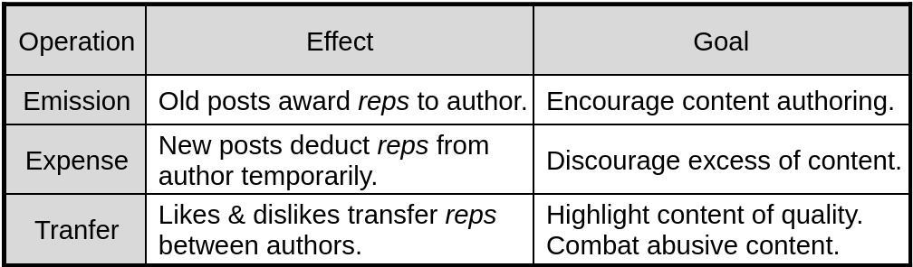
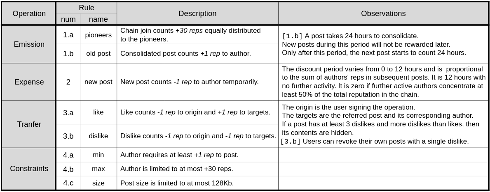

# Freechains: Reputation System

In the absence of moderation, permissionless peer-to-peer public forums are
impractical, mostly because of Sybil attacks.
For instance, it should take a few seconds to generate thousands of fake
identities and SPAM million of messages into the system.
The reputation system of Freechains works together with a
[consensus algorithm](cons.md) to mitigate Sybil attacks and make peer-to-peer
public forums practical.

Each chain is controlled by an autonomous reputation system that receives input
from users (authors) based on likes and dislikes to posts.
The reputation system tracks the reputation of posts and authors in the chain.
Each chain is independent, so the reputation of a given author may vary across
chains.
The unit of reputation is known as ***rep*** and can be created, spent, and
transferred:

Users can spend reps to post and rate content in the forums:
    a ***post*** initially penalizes authors until it consolidates and counts positively;
    a ***like*** is a positive feedback that helps subscribers distinguish good content amid excess;
    a ***dislike*** is a negative feedback that revokes content when crossing a threshold.

The concrete rules are as follows:

- ***Rule 1.a*** bootstraps a public chain, assigning *30 reps* equally
  distributed to the pioneers referred in the public keys.
  The pioneers shape the initial culture of the chain with their first posts
  and likes.
- ***Rule 1.b*** awards authors of new posts with 1 rep, but only after 24
  hours.
  This rule stimulates content creation and grows the economy of chains.
  The 24-hour period gives sufficient time for other users to judge the post
  before awarding the author.
  It also regulates the growth speed of the chain.
- ***Rule 2*** imposes a temporary cost of *1 rep* for each new post.
  The cost period depends on the activity succeeding (and including) the new
  post.
  The more activity from reputed authors, the less time the discount persists.
- ***Rules 3.a and 3.b*** for *likes* and *dislikes* serve three purposes:
    (i) welcoming new users,
    (ii) measuring the quality of posts, and
    (iii) censoring abuse (SPAM, fake news, illegal content, etc).
  Likes and dislikes may affect the state of [posts](blocks.md).
- ***Rule 4.a*** imposes that authors require at least *1 rep* to post,
  effectively blocking Sybil actions.
  Note that ***Rule 1.a*** solves the chicken-and-egg problem imposed by this
  rule.
- ***Rule 4.b*** limits authors to at most *30 reps*, which provides incentives
  to spend likes and thus decentralize the network.
- ***Rule 4.c*** limits the size of posts to at most *128 Kb* to prevent DDoS
  attacks using gigantic blocked posts.

See also the command-line interface for
    [likes and dislikes](cmds.md#chain-like--dislike) to posts
    and to [check the reputation](cmds.md#chain-reps) of posts and authors.

## Design Goals

The reputation system of Freechains aims to preserve the quality of posts in a
chain along with fairness among its authors.

The quality of posts is subjective and is up to users to judge them with likes,
dislikes or simply abstaining.
A user can dislike a post for a number of reasons, such as for considering it
offensive, SPAM, fake, illegal, or even for disagreement.
On the one hand, since likes and dislikes are finite, users have to ponder
before spending them.
On the other hand, since reputation is limited to at most *30 reps*, users also
have incentives to cooperate with the quality of the chain.
The contents of a post can be hidden if the number of dislikes is higher than
the number of likes.
This rule is not intended to eliminate disagreements of opinion, but only to
ban malicious users (e.g. a *troll*, *spammer*, or *abuser*).
The excess of dislikes not only hides a post, but also consumes the reputation
of its author to the point that s/he cannot post again.

We consider that in a fair chain, users have equal opportunities to speak, or
at least that the amount of noise is limited.
Freechains restricts the number of posts in two ways: first, new posts penalize
authors in the first 12 hours; second, at most one post per day can generate
reputation for an author.
The first rule prevents that an author posts too many messages in sequence at
the cost of decreasing its reputation very fast.
The second rule limits the amount of reputation the user can collect over time,
which also affects the frequency in which users post.
These rules mostly apply to neutral posts that do not receive much attention
from other users with likes and dislikes.
However, if a given author receives a lot of likes in her posts, it means that
other users are conceding their own voices to the author.
Similarly, a dislike means that other users are conceding their own voices to
mute the author.

The bootstrap of chains is also a situation that deserves clarification.
At the beginning, only the chain pioneer has reputation.
Since new posts require previous reputation, no other authors can post in the
chain unless the pioneer approves it.
After some time, other authors can self-approve their own posts and build up
reputation.
However, the pioneer can still interfere early in the process with enough
dislikes to clear someone else's reputation at the point of banishment.
The early dynamics of a chain determines how the community evolves, since new
users can inspect the actions of the pioneer and other authors that emerge with
reputation.
Ultimately, users can always recreate or join chains that better adhere to
their principles.

The size of the "economy" of each chain is its amount of consolidated posts.
Likes and dislikes only transfer reputation between authors, and the initial
reputation for the pioneer becomes negligible as time goes.
The number of accountable consolidated posts is also limited to at most one per
day per author.
Hence, the size of the economy highly depends on the number of active authors
in the chain.
This mechanism creates incentives to welcome new users to participate and post
in the chain.
In contrast, this mechanism also disincentives authors to dislike posts, since
they drain *2 reps* into the void.
On the one hand, we believe that this fact contributes to sustain healthy
discussions with a reasonable degree of disagreement, otherwise the economy of
chains would collapse with an outbreak of dislikes.
On the other hand, obvious undesired content like SPAM is rapidly banned (along
with its author) with a few dislikes that do not affect the chain economy.
